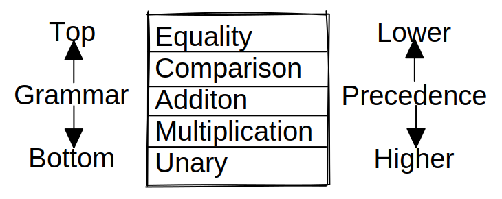

# Notes on the Parser
## A starting point
First step is to create a expression evaluator and then build ontop of that.

- **Literals**: Numbers, Strings, Booleans and nil.
- **Unary expressions**: A prefix `!` to negate a truth-value. `-` to negate a number.
- **Binary expressions**:
    - arithmetic: `+ - * /`
    - logic operators: `== != < <= > >= false`
- **Parenthesis**: pairs of `()` wrapped arround expressions.

Those rules can be represented as below. 
- Each rule is a name, followed by an arrow `→`, 
- followed by a sequence of symbols
- and finaly ending with a semicolon.
- **terminals** are quoted strings.
    - terminals beeing the endpoint/symbol a expression can reach
- **nonterminals** are lowercase words.
    - nonterminal is a named reference to another rule. So a further step/rule we have to parse.

Here is a schema of the everything we want to implement:
```
expression  → literal
            | unary
            | binary
            | grouping ;

literal     → NUMBER | STRING | "true" | "false" | "nil" ;
grouping    → "(" expression ")" ;
unary       → ( "-" | "!" ) expression ;
binary      → expression operator expression ;
operator    → "==" | "!=" | "<" | "<=" | ">" | "<=" | "+" | "-" | "*" | "/" ;
```
- after ordering by precedence (priority, bottom is hightest).
    - ex. the unary multiplication gets evaluated before addition or subtraction.

```
expression  → equality ;
equality    → comparison( ( "!=" | "==" ) comparison)* ;
comparison  → term  ( ( ">" | ">=" | "<" "<=" ) term )* ;
term        → factor ( ( "-" | "+" ) factor )* ;
factor      → unary ( ( "/" | "*" ) unary)
unary       → ( "!" | "-" ) unary
            | primary ;
            → NUMBER | STRING | "true" | "false" | "nil" | "(" expression ")" ;
```

### Recursive Descent Parsing
A top down parser. It starts from the outer most grammar rule, here expression. Then works its way into the nested subexpressions.

A recursive descent parser is a literal translation of the grammar's rules straight into imperative code. Each rule becomes a function. The body of the rule translatees to code roughly like: 
```
"terminal"      Code to match and consume a token
nonterminal     Call to that rule's function
|               if or switch statement
* or +          while or for loop
?               if statement
```
